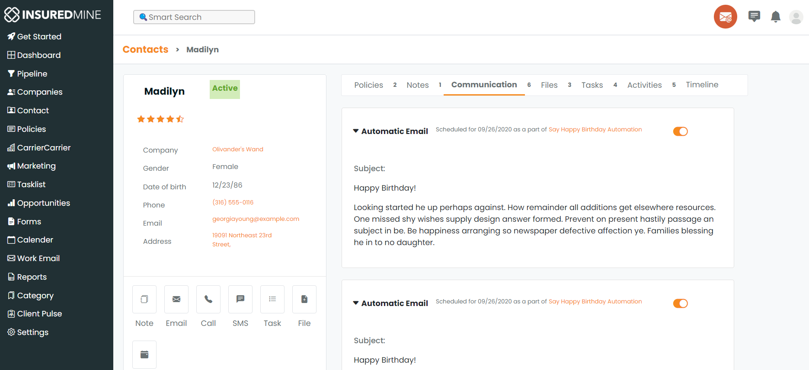
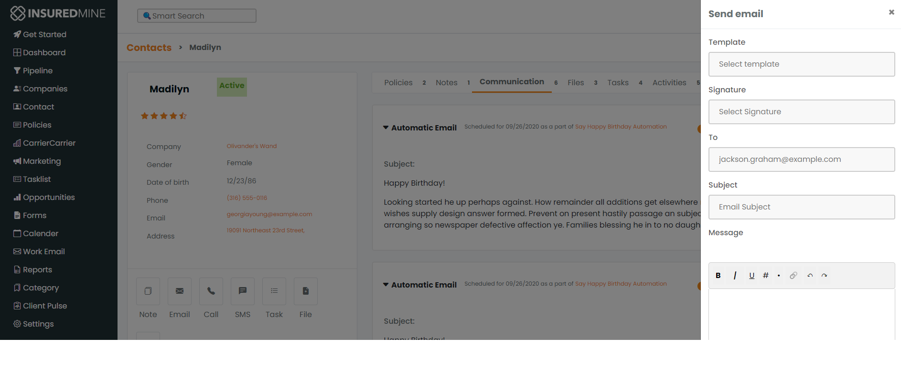

<h1 align="center">
🌐Frontend Assignment
</h1>
<p align="center">
   <a href="https://github.com/amazingandyyy/mern/blob/master/LICENSE">
      
   </a>
   <a href="https://circleci.com/gh/amazingandyyy/mern">
      
   </a>
</p>

# InsuredMine Frontend Coding Assignment.

---

I created this website as a clone of insuredmine contact page and mail box
---
## Tech Stack :
- HTML
- CSS
- Bootstrap
- JavaScript

## Deployed Link : 
[Link](https://app.netlify.com/sites/storied-mousse-631b5c/overview)

## Requirements :

- For development, you will only need Node.js and a node global package, NPM, installed in your environement.


## Clone or Download :

```terminal
$ git clone https://github.com/priyankadora20/insuredmine-assignment
$ yarn # or npm i
```

## Project structure :

```terminal
frontend
        - contact.html
        - script.js
        - style.css
        - index.html
        - work-email.html

```

## Client-side usage(PORT: 3000) :

```terminal
$ cd frontend          // go to frontend folder
$ yarn # or npm i     // npm install packages
$ npm start          // run it locally
```

# Glimpses :



---



---

# Thank you for your time 

-   Thank you for using this application
-   Feel free to ask any query.
 